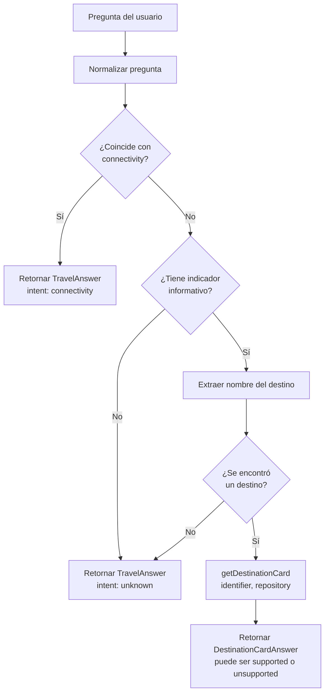
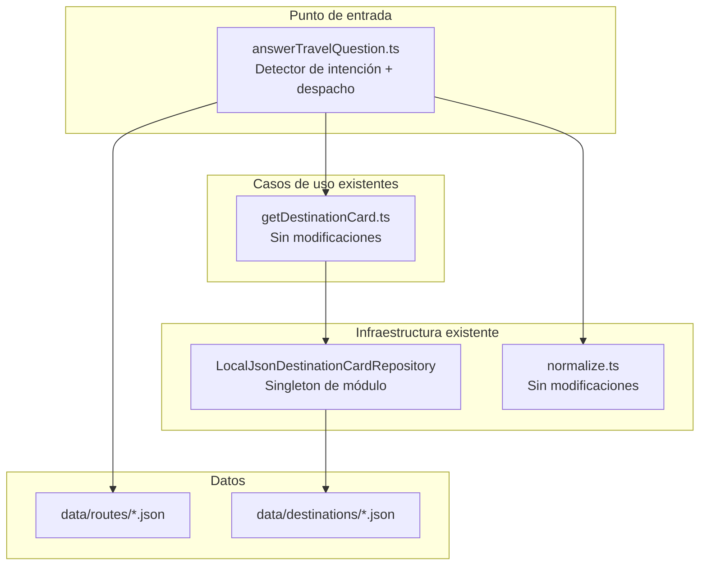

# Documento de Diseño — Destination Information Answer

## Overview

Este diseño describe cómo integrar las fichas de destino locales con el punto de entrada público `answerTravelQuestion`, permitiendo que el agente responda preguntas informativas sobre destinos del sur austral de Chile. La integración se logra modificando únicamente `answerTravelQuestion.ts` para agregar un detector de intención "destination-info" que delega a `getDestinationCard`, sin duplicar lógica existente.

La detección de intención informativa se separa en dos pasos: (1) verificar que la pregunta contiene un indicador informativo, y (2) extraer el nombre del destino mencionado. Si ambos se cumplen, se invoca `getDestinationCard` con el identificador extraído. Si el destino no existe en el repositorio, `getDestinationCard` responde con `unsupported` / `destination-info` — sin caer a "unknown".

### Decisiones de diseño clave

| Decisión | Justificación |
|----------|---------------|
| Modificar `answerTravelQuestion` en vez de crear nuevo endpoint | Mantiene un único punto de entrada público como indica la arquitectura actual |
| Prioridad: connectivity > destination-info > unknown | Preserva el comportamiento existente sin regresiones |
| Detección en dos pasos (indicador + destino) | Separa responsabilidades y permite manejar destinos no cubiertos correctamente |
| Destinos no cubiertos → unsupported/destination-info | Si hay intención informativa clara, se delega a `getDestinationCard` que retorna unsupported, sin caer al fallback "unknown" |
| Tipo de retorno unión: `TravelAnswer \| DestinationCardAnswer` | Permite retornar ambos contratos sin forzar campos vacíos artificiales |
| Repositorio como singleton de módulo | Una sola instancia creada al cargar el módulo, reutilizada en todas las consultas |
| Sin indicador informativo → unknown | Una mención aislada del destino sin contexto informativo no activa destination-info |

---

## Architecture

### Diagrama de flujo de decisión



### Diagrama de componentes



### Coexistencia de intenciones

El orden de evaluación dentro de `answerTravelQuestion` es:

1. **connectivity** (prioridad máxima): si la pregunta normalizada contiene un origen + destino + indicador de viaje → retornar `TravelAnswer` de conectividad.
2. **destination-info** (dos pasos):
   - Paso A: ¿la pregunta contiene un indicador informativo?
   - Paso B: ¿la pregunta menciona un destino extraíble?
   - Si ambos → invocar `getDestinationCard(identifier, repository)` y retornar su resultado (puede ser supported o unsupported).
3. **unknown** (fallback): si no coincide con ningún patrón → retornar `TravelAnswer` unsupported.

---

## Components and Interfaces

### 1. Modificación: `answerTravelQuestion`

**Archivo:** `src/application/answerTravelQuestion.ts`

**Firma actualizada:**

```typescript
export function answerTravelQuestion(question: string): TravelAnswer | DestinationCardAnswer;
```

**Imports nuevos:**

```typescript
import { resolve } from "node:path";
import { LocalJsonDestinationCardRepository } from "../adapters/LocalJsonDestinationCardRepository.js";
import { getDestinationCard } from "./getDestinationCard.js";
import type { DestinationCardAnswer } from "../domain/types.js";
```

**Singleton del repositorio:**

```typescript
// Se crea una sola vez al cargar el módulo.
// Usa la misma ruta data/destinations/ probada y validada por el proyecto.
const destinationRepository = new LocalJsonDestinationCardRepository(
  resolve(import.meta.dirname, "../../data/destinations")
);
```

**Paso A — Detección de indicador informativo:**

```typescript
const DESTINATION_INFO_INDICATORS = [
  "que es", "que son",
  "cuentame", "cuenteme",
  "informacion",
  "donde esta", "donde queda",
  "hablame", "hableme",
  "sobre",
  "acerca de",
  "describir", "descripcion",
];

function hasInfoIndicator(normalized: string): boolean {
  return DESTINATION_INFO_INDICATORS.some((ind) => normalized.includes(ind));
}
```

**Paso B — Extracción del nombre del destino:**

Para los destinos cubiertos se usa una lista cerrada que mapea al identificador normalizado:

```typescript
const KNOWN_DESTINATIONS: Array<{ pattern: string; identifier: string }> = [
  { pattern: "punta arenas", identifier: "punta arenas" },
  { pattern: "puerto williams", identifier: "puerto williams" },
  { pattern: "cabo de hornos", identifier: "cabo de hornos" },
];

function extractDestinationName(normalized: string): string | null {
  // 1. Buscar coincidencia en destinos conocidos
  const known = KNOWN_DESTINATIONS.find((d) => normalized.includes(d.pattern));
  if (known) return known.identifier;

  // 2. Para destinos no conocidos: buscar sustantivos tras indicadores.
  //    Estrategia simple: extraer el segmento posterior al indicador.
  //    Ejemplo: "que es ushuaia" → "ushuaia"
  for (const ind of DESTINATION_INFO_INDICATORS) {
    const idx = normalized.indexOf(ind);
    if (idx !== -1) {
      const afterIndicator = normalized.slice(idx + ind.length).trim();
      // Limpiar signos de interrogación y puntuación
      const cleaned = afterIndicator.replace(/[?¿!¡.,;:]/g, "").trim();
      if (cleaned.length > 0) return cleaned;
    }
  }

  return null;
}
```

**Lógica de despacho actualizada:**

```typescript
export function answerTravelQuestion(question: string): TravelAnswer | DestinationCardAnswer {
  const normalized = normalize(question);

  // 1. Prioridad: connectivity
  if (isSupportedConnectivityQuestion(normalized)) {
    return { /* respuesta de conectividad existente, sin cambios */ };
  }

  // 2. destination-info (dos pasos)
  if (hasInfoIndicator(normalized)) {
    const destinationName = extractDestinationName(normalized);
    if (destinationName) {
      // Delega a getDestinationCard — puede retornar supported o unsupported
      return getDestinationCard(destinationName, destinationRepository);
    }
  }

  // 3. Fallback: unknown
  return { /* respuesta unsupported existente, sin cambios */ };
}
```

**Nota importante:** `isSupportedConnectivityQuestion` se refactoriza internamente para recibir el string ya normalizado (evita doble normalización), pero su comportamiento externo no cambia.

### 2. Sin cambios: `getDestinationCard`

Permanece exactamente como está. Recibe el nombre del destino extraído y el repositorio singleton. Si el destino no existe (ej. "Ushuaia"), retorna `{ status: "unsupported", intent: "destination-info", confidence: "none", ... }`.

### 3. Sin cambios: `LocalJsonDestinationCardRepository`

Permanece exactamente como está. Se instancia una sola vez como variable de módulo en `answerTravelQuestion.ts`, usando `resolve(import.meta.dirname, "../../data/destinations")` — la misma ruta de datos probada por el proyecto.

### 4. Sin cambios: `normalize`, validador, tipos, fichas JSON

Nada se modifica fuera de `answerTravelQuestion.ts` y `src/index.ts` (para actualizar el export del tipo de retorno).

---

## Data Models

### Tipo de retorno unión

```typescript
export function answerTravelQuestion(question: string): TravelAnswer | DestinationCardAnswer;
```

El consumidor distingue el tipo de respuesta por el campo `intent`:
- `"connectivity"` → es `TravelAnswer` (contiene `stages`)
- `"destination-info"` → es `DestinationCardAnswer` (contiene `confidence`, `card`, `suggestedInternalLinks`)
- `"unknown"` → es `TravelAnswer` (status "unsupported")

**Type guard sugerido (para consumidores):**

```typescript
function isDestinationCardAnswer(answer: TravelAnswer | DestinationCardAnswer): answer is DestinationCardAnswer {
  return answer.intent === "destination-info";
}
```

### Constantes de detección

```typescript
// Indicadores informativos (normalizados, sin diacríticos)
const DESTINATION_INFO_INDICATORS: string[]

// Destinos cubiertos con su identificador normalizado
const KNOWN_DESTINATIONS: Array<{ pattern: string; identifier: string }>
```

No se introducen tipos nuevos. Se reutiliza todo de `src/domain/types.ts`.

---

## Correctness Properties

### Property 1: Prioridad de connectivity sobre destination-info

Para cualquier pregunta que satisface los criterios de connectivity (origen + destino + indicador de viaje), el sistema SHALL clasificar como "connectivity" independientemente de si también contiene indicadores informativos o nombres de destino.

**Validates: Requirements 1.2, 4.1, 4.2**

### Property 2: Indicador informativo + destino cubierto → supported/destination-info

Para cualquier pregunta que contiene un indicador informativo y menciona un destino cubierto (Punta Arenas, Puerto Williams o Cabo de Hornos), y que NO satisface connectivity, el sistema SHALL retornar `DestinationCardAnswer` con status "supported" e intent "destination-info".

**Validates: Requirements 1.1, 1.5, 2.1, 3.1**

### Property 3: Indicador informativo + destino no cubierto → unsupported/destination-info

Para cualquier pregunta que contiene un indicador informativo y menciona un destino que no está en el repositorio (ej. "Ushuaia"), el sistema SHALL retornar `DestinationCardAnswer` con status "unsupported", intent "destination-info" y confidence "none". NO cae a "unknown".

**Validates: Requirements 2.4, 5.2**

### Property 4: Sin indicador informativo → unknown

Para cualquier pregunta que menciona un destino cubierto pero NO contiene un indicador informativo (ej. solo "Puerto Williams"), el sistema SHALL retornar intent "unknown" con status "unsupported".

**Validates: Requirements 1.3, 5.1**

### Property 5: Sin destino extraíble + con indicador → unknown

Para cualquier pregunta que contiene un indicador informativo pero no se puede extraer un nombre de destino (ej. "Información"), el sistema SHALL retornar intent "unknown" con status "unsupported".

**Validates: Requirements 1.3, 5.1**

### Property 6: No invención de datos

Para cualquier pregunta, la respuesta SHALL contener únicamente datos provenientes de las fichas JSON locales o de los archivos de ruta, sin contenido generado ni extrapolado.

**Validates: Requirements 3.3, 5.3**

### Property 7: Singleton del repositorio

El sistema SHALL instanciar `LocalJsonDestinationCardRepository` exactamente una vez durante la vida del módulo, no en cada consulta.

**Validates: Requirements 2.2**

---

## Error Handling

| Escenario | Comportamiento |
|-----------|---------------|
| Pregunta vacía o solo whitespace | Retorna `TravelAnswer` unsupported/unknown (sin indicador informativo) |
| Destino cubierto + indicador informativo | `getDestinationCard` retorna supported; se propaga |
| Destino no cubierto + indicador informativo (ej. "¿Qué es Ushuaia?") | `getDestinationCard` retorna unsupported/destination-info/none; se propaga |
| Indicador informativo sin destino extraíble | Cae al fallback unknown |
| Destino cubierto sin indicador informativo (ej. solo "Puerto Williams") | Cae al fallback unknown |
| Repositorio vacío (directorio sin JSONs) | `getDestinationCard` retorna unsupported para cualquier destino |
| Pregunta de connectivity con destino cubierto | Prioridad connectivity; no se evalúa destination-info |

---

## Testing Strategy

### Enfoque: tests unitarios deterministas con Vitest

Sin dependencias adicionales. Todos los tests usan el repositorio real con las fichas de `data/destinations/`.

### Tests (`tests/answerTravelQuestion.test.ts` — ampliación)

| Test | Input | Resultado esperado |
|------|-------|-------------------|
| Puerto Williams info | "¿Qué es Puerto Williams?" | intent: destination-info, status: supported, card.id: puerto-williams |
| Punta Arenas info | "Cuéntame sobre Punta Arenas" | intent: destination-info, status: supported, card.id: punta-arenas |
| Cabo de Hornos info | "Información de Cabo de Hornos" | intent: destination-info, status: supported, card.id: cabo-de-hornos |
| Variación mayúsculas | "HABLAME DE PUERTO WILLIAMS" | intent: destination-info, status: supported |
| Variación sin acento | "Donde esta Punta Arenas" | intent: destination-info, status: supported |
| Destino no cubierto | "¿Qué es Ushuaia?" | intent: destination-info, status: unsupported, confidence: none |
| Sin indicador + destino | "Puerto Williams" | intent: unknown, status: unsupported |
| Pregunta no relacionada | "¿Cuánto cuesta un café?" | intent: unknown, status: unsupported |
| Regresión connectivity | "¿Cómo llegar desde Santiago a Puerto Williams?" | intent: connectivity, status: supported, stages.length: 2 |

### Organización de archivos de test

```
tests/
├── answerTravelQuestion.test.ts    # Se AMPLÍA con nuevos tests (no se reescriben los existentes)
└── getDestinationCard.test.ts      # Existente, sin modificar
```

### Ejecución

`vitest run` ejecuta todos los tests. No requiere red, LLM, RAG ni servicios externos.
