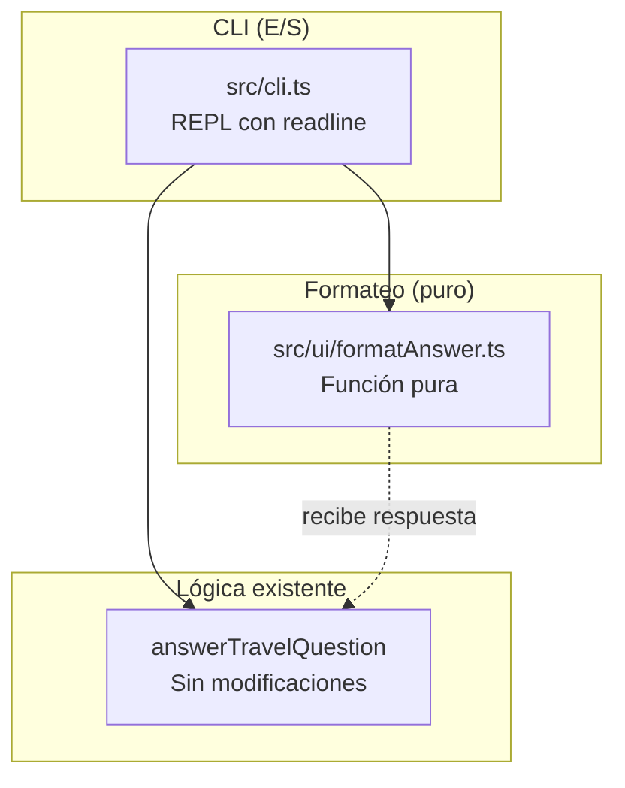
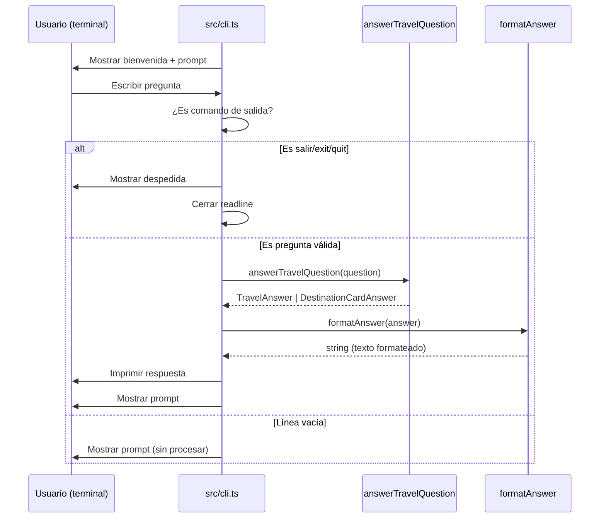

# Documento de Diseño — Interactive CLI Demo

## Overview

Este diseño describe la implementación de una demostración interactiva por terminal (REPL) que permite explorar las capacidades del agente de viaje escribiendo preguntas en lenguaje natural. La arquitectura separa estrictamente el formateador puro (función sin efectos secundarios) del bucle de entrada/salida de consola, permitiendo testear el formateo independientemente del I/O.

### Decisiones de diseño clave

| Decisión | Justificación |
|----------|---------------|
| Formateador como función pura | Permite tests unitarios sin mockear readline ni stdout |
| `node:readline/promises` para el REPL | Módulo estándar de Node.js, sin dependencias externas |
| Archivo de entrada `src/cli.ts` separado de `src/index.ts` | No altera el punto de entrada existente del proyecto |
| Script npm `"demo"` para ejecutar | Conveniencia sin modificar el script `"dev"` existente |
| Sin colores ANSI | Mantiene compatibilidad con cualquier terminal sin dependencias |

---

## Architecture

### Diagrama de componentes



### Flujo de datos



---

## Components and Interfaces

### 1. Formateador puro: `formatAnswer`

**Archivo:** `src/ui/formatAnswer.ts`

```typescript
import type { TravelAnswer, DestinationCardAnswer } from "../domain/types.js";

export function formatAnswer(answer: TravelAnswer | DestinationCardAnswer): string;
```

**Comportamiento:**

Discrimina por el campo `intent` y la presencia de `"confidence"` en el objeto:

- **connectivity + supported**: muestra resumen, etapas (origen → destino | modo | nota), advertencias y fuentes.
- **destination-info + supported**: muestra nombre, resumen, contexto geográfico, contexto cultural, advertencias, fuentes (título, editor, URL, verifiedAt), enlaces internos (ruta + label), confidence y verifiedAt.
- **destination-info + unsupported**: mensaje indicando destino no disponible.
- **unknown + unsupported**: mensaje indicando consulta no reconocida.

**Formato de salida ejemplo (destination-info):**

```
━━━ Punta Arenas ━━━

Resumen: Punta Arenas es una ciudad situada junto al Estrecho...

Contexto geográfico:
  Se ubica en la ribera continental del Estrecho de Magallanes...

Contexto cultural:
  La ciudad concentra patrimonio portuario, ganadero y urbano...

Advertencias:
  • Los horarios, tarifas y disponibilidad de vuelos...
  • El viento y las condiciones meteorológicas...

Fuentes:
  1. Reporte Comunal de Punta Arenas 2025
     Editor: Biblioteca del Congreso Nacional de Chile
     URL: https://www.bcn.cl/...
     Verificado: 2026-07-25

Enlaces sugeridos:
  → /puerto-williams — Puerto Williams
  → /cabo-de-hornos — Cabo de Hornos

Confidence: high
Verificado: 2026-07-25
```

**Formato de salida ejemplo (connectivity):**

```
━━━ Conectividad ━━━

Resumen: La conexión habitual desde Santiago...

Etapas:
  1. Santiago → Punta Arenas [aéreo]
     Los horarios, tarifas y disponibilidad deben verificarse...
  2. Punta Arenas → Puerto Williams [aéreo o marítimo]
     La operación aérea o marítima puede variar...

Advertencias:
  • No se deben asumir horarios...
  • Confirma cada tramo con fuentes oficiales...

Fuentes:
  1. Información oficial de conectividad austral...
     Verificado: 2026-07-24
```

**Formato de salida (unsupported):**

```
⚠ El destino consultado no está disponible en la base local.
```

o

```
⚠ La base local todavía no contiene evidencia suficiente para responder esta consulta.
```

### 2. REPL de consola: `src/cli.ts`

**Archivo:** `src/cli.ts`

```typescript
import { createInterface } from "node:readline/promises";
import { stdin, stdout } from "node:process";
import { answerTravelQuestion } from "./application/answerTravelQuestion.js";
import { formatAnswer } from "./ui/formatAnswer.js";

const EXIT_COMMANDS = ["salir", "exit", "quit"];

async function main(): Promise<void> {
  const rl = createInterface({ input: stdin, output: stdout });

  console.log("═══ End of the World Travel Agent ═══");
  console.log("Escribe una pregunta o 'salir' para terminar.\n");

  while (true) {
    const line = await rl.question("▶ ");
    const trimmed = line.trim();

    if (trimmed.length === 0) continue;
    if (EXIT_COMMANDS.includes(trimmed.toLowerCase())) {
      console.log("\nHasta pronto. Buen viaje.");
      rl.close();
      break;
    }

    const answer = answerTravelQuestion(trimmed);
    const output = formatAnswer(answer);
    console.log("\n" + output + "\n");
  }
}

main();
```

### 3. Script npm

Agregar en `package.json`:

```json
{
  "scripts": {
    "demo": "tsx src/cli.ts"
  }
}
```

---

## Data Models

No se introducen tipos nuevos. El formateador opera sobre la unión existente `TravelAnswer | DestinationCardAnswer` y produce `string`.

**Discriminación de tipos en el formateador:**

```typescript
function isDestinationCardAnswer(answer: TravelAnswer | DestinationCardAnswer): answer is DestinationCardAnswer {
  return "confidence" in answer;
}
```

---

## Correctness Properties

### Property 1: Pureza del formateador

Para cualquier objeto válido de tipo `TravelAnswer | DestinationCardAnswer`, la función `formatAnswer` SHALL retornar un `string` sin efectos secundarios, sin acceder a `process.stdout`, `readline`, ni a ningún recurso externo.

**Validates: Requirements 5.1, 5.3**

### Property 2: Cobertura de todos los tipos de respuesta

Para cualquier combinación válida de `intent` × `status` que el sistema puede producir (connectivity/supported, destination-info/supported, destination-info/unsupported, unknown/unsupported), `formatAnswer` SHALL producir una cadena no vacía y legible.

**Validates: Requirements 2.1, 3.1, 4.1, 4.2, 4.3**

### Property 3: No invención de datos

Para cualquier respuesta, el texto producido por `formatAnswer` SHALL contener únicamente información presente en el objeto recibido, sin agregar datos, URLs, fechas ni afirmaciones que no estén en la respuesta.

**Validates: Requirements 7.6**

### Property 4: Comandos de salida terminan el bucle

Para cualquier variante de "salir", "exit" o "quit" (insensible a mayúsculas y espacios laterales), el REPL SHALL terminar el bucle y cerrar readline.

**Validates: Requirements 1.3**

### Property 5: Líneas vacías no invocan la lógica

Para cualquier entrada vacía o compuesta solo de espacios, el REPL SHALL NO invocar `answerTravelQuestion` y SHALL volver a mostrar el prompt.

**Validates: Requirements 1.4**

---

## Error Handling

| Escenario | Comportamiento |
|-----------|---------------|
| Línea vacía o solo espacios | Ignorar, volver a prompt |
| Comando de salida | Mensaje de despedida, cerrar readline |
| Respuesta unsupported/unknown | Mostrar mensaje indicando que no puede responder |
| Respuesta unsupported/destination-info | Mostrar mensaje indicando destino no disponible |
| Error inesperado en answerTravelQuestion | Capturar, mostrar "Error interno" en consola, continuar el bucle |
| EOF en stdin (Ctrl+D) | readline emite 'close', el bucle termina limpiamente |

---

## Testing Strategy

### Enfoque: tests unitarios deterministas para el formateador

El REPL (`src/cli.ts`) no se testea unitariamente porque su responsabilidad es exclusivamente I/O. El formateador puro (`src/ui/formatAnswer.ts`) se testea con datos fijos.

### Tests (`tests/formatAnswer.test.ts`)

| Test | Input | Verifica |
|------|-------|----------|
| Connectivity supported | TravelAnswer con 2 etapas, fuentes, advertencias | Contiene resumen, etapas, advertencias, fuentes |
| Destination-info supported | DestinationCardAnswer con card completa | Contiene nombre, resumen, contexto geo, contexto cultural, warnings, sources, links, confidence, verifiedAt |
| Unsupported/destination-info | DestinationCardAnswer con status unsupported | Contiene mensaje de destino no disponible |
| Unsupported/unknown | TravelAnswer con intent unknown | Contiene mensaje de consulta no reconocida |

### Organización de archivos

```
src/
├── cli.ts                    # REPL (no testeado unitariamente)
├── ui/
│   └── formatAnswer.ts       # Formateador puro (testeado)
tests/
├── formatAnswer.test.ts      # Tests del formateador
├── answerTravelQuestion.test.ts  # Existente, sin modificar
└── getDestinationCard.test.ts    # Existente, sin modificar
```

### Ejecución

`vitest run` ejecuta todos los tests incluyendo los nuevos del formateador. No requiere red, readline ni interacción de usuario.
