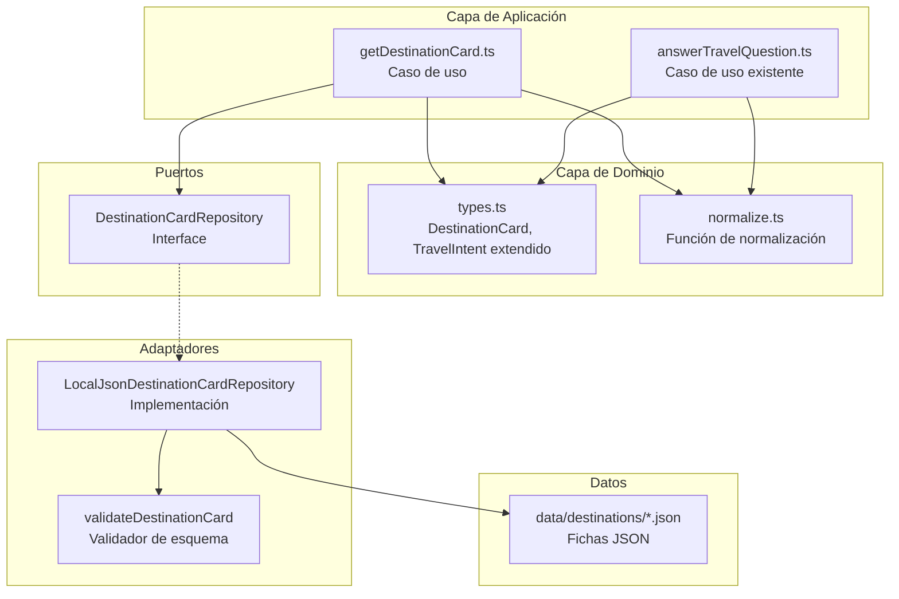
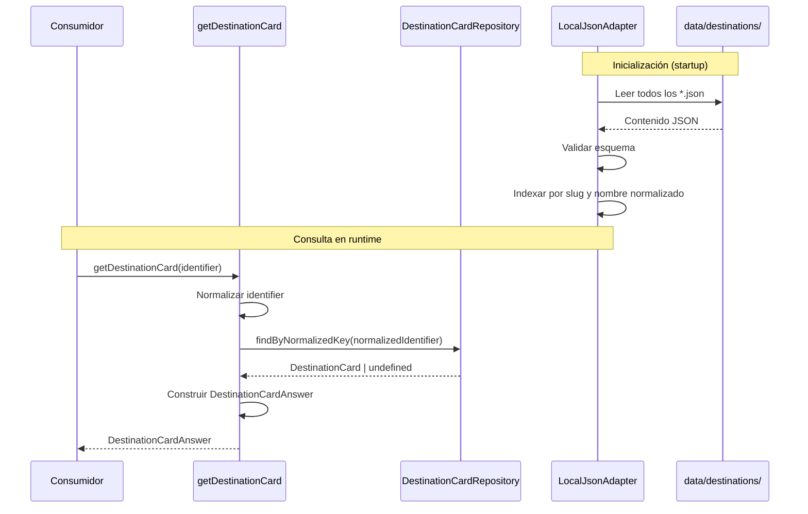

# Documento de Diseño — Local Destination Cards

## Overview

Este diseño describe la arquitectura para el módulo de fichas de destino locales, un segundo slice vertical del sistema End of the World Travel Agent. El módulo permite recuperar fichas informativas estructuradas sobre destinos del sur austral de Chile, almacenadas como archivos JSON locales y servidas sin dependencia de servicios externos.

El diseño se integra con la arquitectura hexagonal existente: extiende los tipos de dominio, define un puerto de repositorio, implementa un adaptador de lectura JSON con validación de esquema en frontera, y expone un caso de uso `getDestinationCard` que coexiste con el flujo de conectividad existente sin conectarse a él.

### Decisiones de diseño clave

| Decisión | Justificación |
|----------|---------------|
| Reutilizar `SourceReference` existente | Mantiene consistencia de contrato y evita duplicación de tipos |
| Validación de esquema manual (sin dependencia externa) | Respeta la restricción de no agregar dependencias hasta que un spec lo apruebe explícitamente |
| Carga eager de fichas al iniciar | Simplifica consultas y permite detección temprana de errores de esquema |
| Normalización compartida con flujo de conectividad | Garantiza comportamiento uniforme de búsqueda en todo el sistema |
| Confidence derivado del estado de fuentes | Cumple contrato de respuesta sin introducir heurísticas complejas |
| Sin validación cruzada de enlaces internos | Simplifica la primera entrega; solo se valida formato de ruta relativa |
| Solo tests unitarios deterministas (sin PBT) | Reduce complejidad y dependencias; se puede agregar fast-check en una fase posterior |

---

## Architecture

### Diagrama de componentes



### Flujo de datos



### Coexistencia con flujo existente

El caso de uso `getDestinationCard` es completamente independiente de `answerTravelQuestion`. No se conecta con el repositorio de rutas. Ambos son invocables directamente por el consumidor. Un futuro router de intención podrá despachar a uno u otro según el tipo de consulta.

---

## Components and Interfaces

### 1. Puerto: `DestinationCardRepository`

**Archivo:** `src/ports/DestinationCardRepository.ts`

```typescript
import type { DestinationCard } from "../domain/types.js";

export interface DestinationCardRepository {
  findByNormalizedKey(normalizedKey: string): DestinationCard | undefined;
  listAll(): DestinationCard[];
  listByRegion(region: string): DestinationCard[];
}
```

**Responsabilidad:** Abstraer el acceso a fichas, permitiendo sustituir la implementación sin modificar dominio ni aplicación.

**Búsqueda por nombre o slug:** El método `findByNormalizedKey` acepta cualquier cadena normalizada y busca coincidencia tanto contra el slug (`id`) como contra el nombre oficial normalizado de cada ficha. Esto permite que `"puerto williams"`, `"Puerto Williams"` y `"puerto-williams"` resuelvan a la misma ficha.

### 2. Adaptador: `LocalJsonDestinationCardRepository`

**Archivo:** `src/adapters/LocalJsonDestinationCardRepository.ts`

```typescript
export class LocalJsonDestinationCardRepository implements DestinationCardRepository {
  private cardsBySlug: Map<string, DestinationCard>;
  private cardsByName: Map<string, DestinationCard>;

  constructor(directoryPath: string);
  findByNormalizedKey(normalizedKey: string): DestinationCard | undefined;
  listAll(): DestinationCard[];
  listByRegion(region: string): DestinationCard[];
}
```

**Comportamiento:**
- En construcción: lee todos los `*.json` de `directoryPath`, valida cada uno, indexa los válidos por slug normalizado y por nombre normalizado.
- Archivos inválidos: se omiten con log de error (no interrumpen carga de los demás).
- Directorio inexistente o vacío: inicia con mapa vacío, registra advertencia.
- `findByNormalizedKey`: busca primero en `cardsBySlug`, luego en `cardsByName`. Retorna la primera coincidencia o `undefined`.

### 3. Validador: `validateDestinationCard`

**Archivo:** `src/adapters/validateDestinationCard.ts`

```typescript
export interface ValidationError {
  path: string;       // e.g. "sources[0].url"
  violation: "missing" | "type" | "range" | "format";
  message: string;
}

export type ValidationResult =
  | { valid: true; card: DestinationCard }
  | { valid: false; errors: ValidationError[] };

export function validateDestinationCard(raw: unknown): ValidationResult;
```

**Alcance de validación (simplificado):**
- Campos obligatorios presentes y no vacíos: `id`, `name`, `region`, `comuna`, `coordinates`, `summary`, `stableData`, `warnings`, `sources`, `suggestedInternalLinks`, `verifiedAt`.
- Tipos correctos: strings donde corresponde, numbers para coordenadas, arrays para warnings/sources/links.
- Coordenadas dentro de rango: latitud ∈ [-90, 90], longitud ∈ [-180, 180].
- Al menos una fuente en el arreglo `sources`.
- Cada fuente tiene `url` presente y no vacía.
- `verifiedAt` es una fecha válida en formato ISO 8601 (YYYY-MM-DD) y no es futura.
- Cada enlace interno tiene `path` que comienza con `/`.

**No valida en esta fase:**
- Límites de longitud de strings (summary, warnings, title).
- Cantidad máxima de advertencias o enlaces.
- Existencia de destinos referenciados por enlaces internos.

### 4. Caso de uso: `getDestinationCard`

**Archivo:** `src/application/getDestinationCard.ts`

```typescript
import type { DestinationCardAnswer } from "../domain/types.js";
import type { DestinationCardRepository } from "../ports/DestinationCardRepository.js";

export function getDestinationCard(
  identifier: string,
  repository: DestinationCardRepository
): DestinationCardAnswer;
```

**Lógica:**
1. Si `identifier` es vacío/nulo/solo-espacios → retorna respuesta `unsupported` con resumen de identificador inválido.
2. Normaliza `identifier` (NFD → eliminar diacríticos → lowercase → trim).
3. Busca en el repositorio con `findByNormalizedKey(normalized)`.
4. Si no encuentra → retorna respuesta `unsupported` con resumen de destino no disponible.
5. Si encuentra → construye `DestinationCardAnswer` con:
   - `status: "supported"`, `intent: "destination-info"`
   - `confidence` derivado del estado de fuentes
   - Advertencia de fuentes desactualizadas (>180 días)
   - `suggestedInternalLinks` tal como están en la ficha (sin filtrado cruzado)

### 5. Función compartida: `normalize`

**Archivo:** `src/domain/normalize.ts` (extraída del actual `answerTravelQuestion.ts`)

```typescript
export function normalize(value: string): string {
  return value
    .normalize("NFD")
    .replace(/[\u0300-\u036f]/g, "")
    .toLowerCase()
    .trim();
}
```

Se extrae a módulo propio para reutilización sin duplicación. El caso de uso de conectividad importará desde aquí en vez de definirla localmente.

---

## Data Models

### TravelIntent (extendido)

```typescript
export type TravelIntent = "connectivity" | "destination-info" | "unknown";
```

### DestinationCard

```typescript
export interface GeoCoordinates {
  latitude: number;   // -90 a 90
  longitude: number;  // -180 a 180
}

export interface StableData {
  geographicContext: string;
  culturalContext: string;
  [key: string]: string;  // Permite subcampos adicionales
}

export interface InternalLink {
  path: string;      // Ruta relativa que comienza con "/", e.g. "/puerto-williams"
  label: string;     // Etiqueta descriptiva
}

export interface DestinationCard {
  id: string;                    // kebab-case slug, e.g. "puerto-williams"
  name: string;                  // Nombre oficial, e.g. "Puerto Williams"
  region: string;
  comuna: string;
  coordinates: GeoCoordinates;
  summary: string;               // Descripción concisa del destino
  stableData: StableData;
  warnings: string[];            // Datos dinámicos expresados como advertencias
  sources: SourceReference[];    // Reutiliza tipo existente, min 1 elemento
  suggestedInternalLinks: InternalLink[];
  verifiedAt: string;            // ISO 8601 YYYY-MM-DD
}
```

### DestinationCardAnswer (contrato de respuesta)

```typescript
export interface DestinationCardAnswer {
  status: AnswerStatus;
  intent: "destination-info";
  summary: string;
  confidence: "high" | "medium" | "none";
  warnings: string[];
  sources: SourceReference[];
  suggestedInternalLinks: InternalLink[];
  verifiedAt?: string;
  card?: DestinationCard;        // Presente solo cuando status === "supported"
}
```

### Estructura JSON de ficha (ejemplo: `data/destinations/puerto-williams.json`)

```json
{
  "id": "puerto-williams",
  "name": "Puerto Williams",
  "region": "Magallanes y de la Antártica Chilena",
  "comuna": "Cabo de Hornos",
  "coordinates": {
    "latitude": -54.9333,
    "longitude": -67.6167
  },
  "summary": "Puerto Williams es una localidad en la costa norte de Isla Navarino, comuna de Cabo de Hornos, Región de Magallanes y de la Antártica Chilena.",
  "stableData": {
    "geographicContext": "Ubicada en la costa norte de Isla Navarino, frente al Canal Beagle. Capital de la comuna Cabo de Hornos.",
    "culturalContext": "Territorio ancestral del pueblo Yagán. Alberga el Museo Martín Gusinde dedicado a la etnografía regional."
  },
  "warnings": [
    "La frecuencia de vuelos y transbordadores desde Punta Arenas varía según temporada y condiciones meteorológicas. Confirmar con operadores.",
    "El acceso marítimo puede suspenderse por condiciones del Canal Beagle. Consultar estado de navegabilidad antes de viajar."
  ],
  "sources": [
    {
      "title": "Municipalidad de Cabo de Hornos — Información comunal",
      "publisher": "Ilustre Municipalidad de Cabo de Hornos",
      "url": "https://www.municipalidadcabodehornos.cl/",
      "verifiedAt": "2025-01-15",
      "status": "verified"
    }
  ],
  "suggestedInternalLinks": [
    { "path": "/punta-arenas", "label": "Punta Arenas — punto de conexión" },
    { "path": "/cabo-de-hornos", "label": "Cabo de Hornos — comuna y destinos" }
  ],
  "verifiedAt": "2025-01-15"
}
```

---

## Correctness Properties

*Propiedades que el sistema debe cumplir en todos los casos. Verificadas mediante tests unitarios deterministas.*

### Property 1: Validación acepta fichas bien formadas

Para toda ficha JSON con campos obligatorios presentes, tipos correctos, coordenadas en rango, al menos una fuente con URL, fecha ISO válida no futura y enlaces con ruta relativa que comienza con `/`, el validador SHALL aceptarla como válida.

**Validates: Requirements 2.1, 2.2, 2.3, 4.1, 4.4, 4.5**

### Property 2: Validación rechaza fichas con errores estructurales

Para toda ficha JSON a la que le falte un campo obligatorio, tenga un tipo incorrecto, coordenadas fuera de rango, fuente sin URL o fecha inválida, el validador SHALL rechazarla y reportar un error con la ruta del campo y el tipo de violación.

**Validates: Requirements 2.6, 4.2, 4.3, 6.5**

### Property 3: Normalización produce búsqueda insensible a case y diacríticos

Para cualquier variante de nombre de destino con cambios de mayúsculas/minúsculas o presencia/ausencia de diacríticos, la normalización SHALL producir el mismo resultado, permitiendo encontrar la misma ficha.

**Validates: Requirements 1.4**

### Property 4: Identificadores vacíos producen respuesta unsupported

Para toda cadena vacía o compuesta solo de whitespace, el caso de uso SHALL retornar `status: "unsupported"` con `intent: "destination-info"`.

**Validates: Requirements 1.3**

### Property 5: Identificador no registrado produce respuesta unsupported estructurada

Para cualquier identificador que no corresponde a ninguna ficha, el caso de uso SHALL retornar `status: "unsupported"`, `confidence: "none"`, arreglos vacíos y `verifiedAt` ausente.

**Validates: Requirements 1.2, 5.5**

### Property 6: El campo intent es siempre "destination-info"

Para cualquier entrada al caso de uso, la respuesta SHALL tener `intent: "destination-info"`.

**Validates: Requirements 5.1, 5.2**

### Property 7: Confidence se deriva del estado de fuentes

Si todas las fuentes son `"verified"` → `confidence: "high"`. Si alguna es `"provisional"` → `confidence: "medium"` con advertencia.

**Validates: Requirements 5.3, 5.4**

### Property 8: Fuentes desactualizadas generan advertencia

Si una fuente tiene `verifiedAt` con más de 180 días desde hoy, la respuesta SHALL incluir una advertencia mencionando el título y la fecha.

**Validates: Requirements 6.3**

---

## Error Handling

| Escenario | Comportamiento | Nivel |
|-----------|---------------|-------|
| Identificador vacío/nulo/whitespace | Retorna `unsupported` con resumen descriptivo | Caso de uso |
| Identificador no encontrado | Retorna `unsupported` con resumen "destino no disponible" | Caso de uso |
| Archivo JSON no legible (I/O error) | Omite ficha, registra error con nombre de archivo | Adaptador |
| Archivo JSON con esquema inválido | Omite ficha, registra error con ruta de campo y violación | Adaptador/Validador |
| Directorio `data/destinations/` inexistente | Inicia con conjunto vacío, registra advertencia | Adaptador |
| Directorio sin archivos `.json` | Inicia con conjunto vacío, registra advertencia | Adaptador |
| Fecha `verifiedAt` futura en archivo | Rechaza ficha con error de validación `"format"` | Validador |
| Fuente sin URL | Rechaza ficha con error indicando `"sources[N].url"` missing | Validador |
| Coordenadas fuera de rango | Rechaza ficha con error indicando `"coordinates.latitude"` o `"coordinates.longitude"` range | Validador |

### Estrategia de logging

- **Errores**: archivos que no pasan validación o no pueden leerse (incluye nombre de archivo y detalle).
- **Advertencias**: directorio vacío/inexistente, fuentes desactualizadas en respuesta.
- **Info**: fichas cargadas exitosamente al iniciar.

Se utiliza `console.error` / `console.warn` / `console.info` por ahora. Sin dependencia de logging externo en esta fase.

---

## Testing Strategy

### Enfoque: tests unitarios deterministas con Vitest

Sin property-based testing en esta fase. Sin dependencias adicionales de testing. Todos los tests usan datos fijos y verifican comportamiento esperado de forma determinista.

### Tests del caso de uso (`tests/getDestinationCard.test.ts`)

| Test | Verifica |
|------|----------|
| Recuperar Punta Arenas | Respuesta `supported` con campos completos y enlaces a destinos australes |
| Recuperar Puerto Williams | Respuesta `supported` con datos geográficos de Isla Navarino |
| Recuperar Cabo de Hornos | Respuesta `supported` con nota de desambiguación (comuna, isla, cabo) |
| Búsqueda por nombre y slug | "Puerto Williams", "puerto williams", "PUERTO WILLIAMS" y "puerto-williams" resuelven a la misma ficha |
| Destino inexistente | Respuesta `unsupported` con estructura completa |
| JSON inválido (campo faltante) | Validador reporta error descriptivo con ruta de campo |
| Coordenadas inválidas | Validador reporta error `"range"` para coordenadas fuera de [-90,90] o [-180,180] |
| Tests de conectividad existentes | `answerTravelQuestion.test.ts` sigue pasando sin modificaciones |

### Organización de archivos de test

```
tests/
├── answerTravelQuestion.test.ts    # Existente, sin modificar
└── getDestinationCard.test.ts      # Tests unitarios del nuevo caso de uso y validador
```

### Dependencias de testing

Ninguna adicional. Se usa únicamente Vitest (ya instalado).

### Ejecución

Todos los tests se ejecutan con `vitest run`, coexistiendo con los tests existentes. No requieren red, LLM, RAG ni servicios externos.
