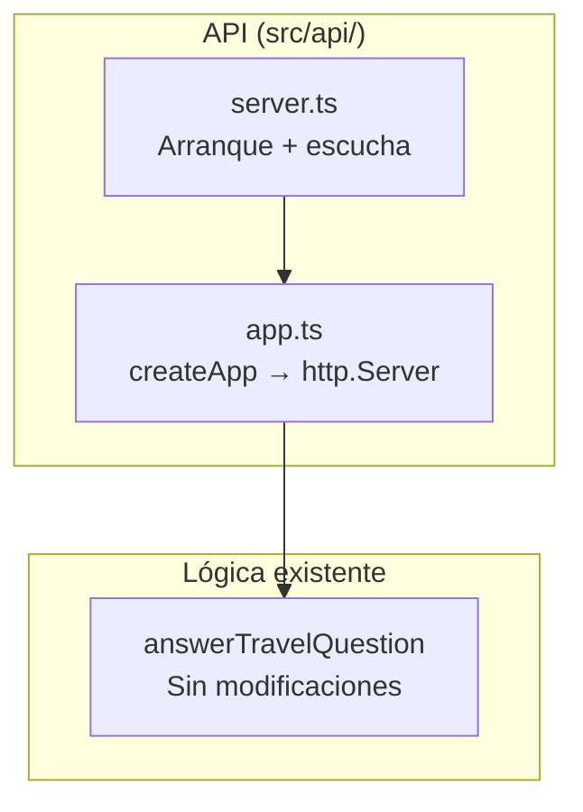
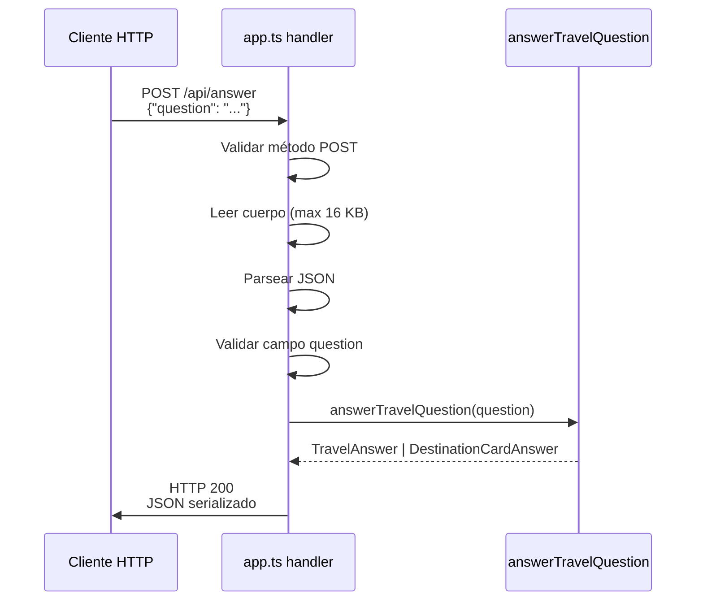

# Documento de Diseño — Local HTTP API

## Overview

Este diseño describe la implementación de una API HTTP local mínima usando exclusivamente `node:http`. El servidor expone dos endpoints (`GET /health` y `POST /api/answer`) que delegan a `answerTravelQuestion` y devuelven respuestas JSON estructuradas. La arquitectura separa la creación del servidor (testeable) del inicio de escucha (producción), facilitando pruebas con puerto efímero.

### Decisiones de diseño clave

| Decisión | Justificación |
|----------|---------------|
| Solo `node:http` | Sin frameworks ni dependencias nuevas |
| `app.ts` separado de `server.ts` | Permite testear el handler sin abrir puertos |
| Límite de 16 KB para cuerpo | Previene lectura ilimitada de memoria sin complejidad |
| Errores con estructura `{ error: { code, message } }` | Consistente, parseable y extensible |
| Puerto efímero (0) en tests | Evita conflictos de puertos en CI |

---

## Architecture

### Estructura de archivos

```
src/api/
├── app.ts       # Exporta createApp() → http.Server (sin escucha)
└── server.ts    # Importa createApp(), inicia escucha en PORT
```

### Diagrama de componentes



### Flujo de una solicitud



---

## Components and Interfaces

### 1. `src/api/app.ts`

```typescript
import { createServer, type Server } from "node:http";
import { answerTravelQuestion } from "../application/answerTravelQuestion.js";

export function createApp(): Server;
```

**Responsabilidades:**
- Crear un `http.Server` con un request handler interno.
- Enrutar solicitudes por URL y método.
- Leer y validar cuerpos JSON.
- Serializar respuestas.
- NO iniciar escucha (`listen` no se llama aquí).

**Request handler interno:**

```typescript
async function handleRequest(req, res): Promise<void> {
  const url = req.url ?? "/";
  const method = req.method ?? "GET";

  // Enrutamiento
  if (url === "/health") {
    return handleHealth(method, res);
  }
  if (url === "/api/answer") {
    return handleAnswer(method, req, res);
  }

  // 404 para todo lo demás
  return sendError(res, 404, "NOT_FOUND", "Not found");
}
```

**Funciones auxiliares internas:**

```typescript
// Leer cuerpo con límite
async function readBody(req: IncomingMessage, maxBytes: number): Promise<string>;

// Enviar respuesta JSON
function sendJson(res: ServerResponse, status: number, body: unknown): void;

// Enviar error estructurado
function sendError(res: ServerResponse, status: number, code: string, message: string): void;
```

### 2. `src/api/server.ts`

```typescript
import { createApp } from "./app.js";

const PORT = parseInt(process.env["PORT"] ?? "3000", 10);
const server = createApp();

server.listen(PORT, () => {
  console.log(`[API] Listening on http://localhost:${PORT}`);
});
```

**Responsabilidad:** Solo configuración de puerto y arranque. Archivo mínimo (~6 líneas).

---

## Contratos de API

### GET `/health`

**Respuesta 200:**
```json
{
  "status": "ok",
  "service": "end-of-the-world-travel-agent"
}
```

**405 si método ≠ GET:**
```json
{
  "error": {
    "code": "METHOD_NOT_ALLOWED",
    "message": "Method not allowed"
  }
}
```
Con encabezado `Allow: GET`.

### POST `/api/answer`

**Solicitud:**
```json
{
  "question": "¿Qué es Puerto Williams?"
}
```

**Respuesta 200 (destination-info/supported):**
```json
{
  "status": "supported",
  "intent": "destination-info",
  "summary": "...",
  "confidence": "high",
  "warnings": [...],
  "sources": [...],
  "suggestedInternalLinks": [...],
  "verifiedAt": "2026-07-25",
  "card": { ... }
}
```

**Respuesta 200 (connectivity/supported):**
```json
{
  "status": "supported",
  "intent": "connectivity",
  "summary": "...",
  "stages": [...],
  "warnings": [...],
  "sources": [...],
  "verifiedAt": "2026-07-25"
}
```

**Respuesta 200 (unsupported):**
```json
{
  "status": "unsupported",
  "intent": "unknown",
  "summary": "...",
  "stages": [],
  "warnings": [...],
  "sources": []
}
```

**405 si método ≠ POST:**
```json
{
  "error": {
    "code": "METHOD_NOT_ALLOWED",
    "message": "Method not allowed"
  }
}
```
Con encabezado `Allow: POST`.

---

## Errores JSON

Todas las respuestas de error siguen esta estructura:

```typescript
interface ApiError {
  error: {
    code: string;
    message: string;
  };
}
```

| HTTP | code | message | Condición |
|------|------|---------|-----------|
| 400 | `INVALID_JSON` | "Invalid JSON body" | Cuerpo no es JSON parseable |
| 400 | `INVALID_REQUEST` | "Field \"question\" is required" | Campo question ausente |
| 400 | `INVALID_REQUEST` | "Field \"question\" must be a non-empty string" | question no es string o está vacía |
| 404 | `NOT_FOUND` | "Not found" | Ruta no existe |
| 405 | `METHOD_NOT_ALLOWED` | "Method not allowed" | Método incorrecto para ruta existente |
| 413 | `PAYLOAD_TOO_LARGE` | "Request body too large" | Cuerpo excede 16 KB |
| 500 | `INTERNAL_ERROR` | "Internal server error" | Error inesperado |

---

## Encabezados

Todas las respuestas incluyen:
- `Content-Type: application/json; charset=utf-8`

Respuestas 405 incluyen adicionalmente:
- `Allow: GET` (para `/health`)
- `Allow: POST` (para `/api/answer`)

---

## Límite de cuerpo

La función `readBody` acumula chunks hasta un máximo de **16384 bytes** (16 KB). Si se excede:
- Destruye el stream de lectura.
- Responde HTTP 413 con `PAYLOAD_TOO_LARGE`.

---

## Error Handling

| Escenario | Comportamiento |
|-----------|---------------|
| JSON malformado en cuerpo | 400 INVALID_JSON |
| Campo question ausente | 400 INVALID_REQUEST |
| Campo question vacío o no string | 400 INVALID_REQUEST |
| Cuerpo > 16 KB | 413 PAYLOAD_TOO_LARGE |
| Ruta no registrada | 404 NOT_FOUND |
| Método incorrecto en ruta existente | 405 METHOD_NOT_ALLOWED + Allow header |
| Error en answerTravelQuestion | 500 INTERNAL_ERROR (log a console.error, sin detalle al cliente) |
| Error inesperado del handler | 500 INTERNAL_ERROR (log a console.error) |

---

## Testing Strategy

### Enfoque: Vitest + puerto efímero + APIs estándar de Node

```typescript
import { createApp } from "../src/api/app.js";
import type { Server } from "node:http";
import type { AddressInfo } from "node:net";

let server: Server;
let baseUrl: string;

beforeAll(async () => {
  server = createApp();
  await new Promise<void>((resolve) => server.listen(0, resolve));
  const { port } = server.address() as AddressInfo;
  baseUrl = `http://localhost:${port}`;
});

afterAll(async () => {
  await new Promise<void>((resolve) => server.close(() => resolve()));
});
```

Las solicitudes usan `fetch` global (disponible en Node 18+) o `node:http` request.

### Tests (`tests/api.test.ts`)

| Test | Solicitud | Resultado esperado |
|------|-----------|-------------------|
| Health check | GET /health | 200, `{"status":"ok","service":"end-of-the-world-travel-agent"}` |
| Connectivity | POST /api/answer `{"question":"¿Cómo llegar desde Santiago a Puerto Williams?"}` | 200, intent: connectivity |
| Destination info | POST /api/answer `{"question":"¿Qué es Puerto Williams?"}` | 200, intent: destination-info |
| Unsupported | POST /api/answer `{"question":"¿Cuánto cuesta un café?"}` | 200, intent: unknown, status: unsupported |
| Missing question | POST /api/answer `{}` | 400, code: INVALID_REQUEST |
| Question not string | POST /api/answer `{"question": 123}` | 400, code: INVALID_REQUEST |
| Empty question | POST /api/answer `{"question": "  "}` | 400, code: INVALID_REQUEST |
| Malformed JSON | POST /api/answer `{not json` | 400, code: INVALID_JSON |
| Unknown route | GET /unknown | 404, code: NOT_FOUND |
| Wrong method | GET /api/answer | 405, code: METHOD_NOT_ALLOWED, Allow: POST |

### Organización de archivos

```
tests/
├── api.test.ts                     # Tests de la API HTTP
├── formatAnswer.test.ts            # Existente, sin modificar
├── answerTravelQuestion.test.ts    # Existente, sin modificar
└── getDestinationCard.test.ts      # Existente, sin modificar
```

### Ejecución

`vitest run` ejecuta todos los tests. El servidor se crea y cierra en cada suite. No requiere red externa, LLM, RAG ni servicios.
