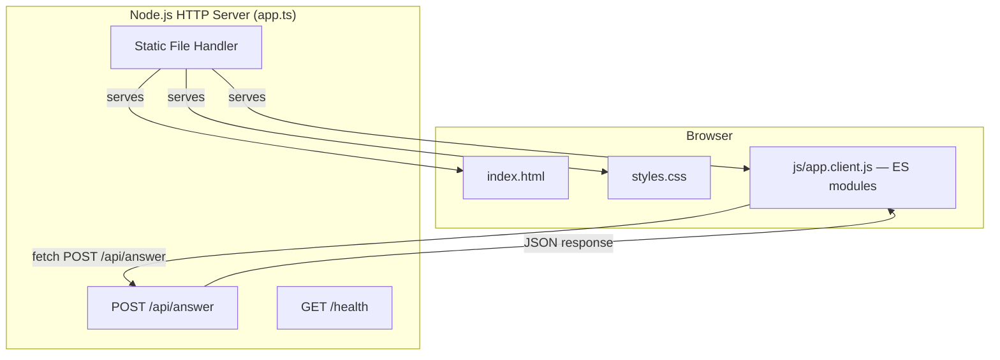

# Design Document: Minimal Web Interface

## Overview

This design adds a lightweight, accessible web interface to the existing End of the World Travel Agent HTTP server. The interface consists of static files (HTML, CSS, and ES module JS) served directly by the current `node:http` server, plus a set of pure TypeScript rendering functions that produce HTML strings from API response objects. No frameworks, bundlers, or heavy dependencies are introduced.

The key architectural decision is to mirror the existing `formatAnswer.ts` pattern: pure functions that accept domain data and return formatted output — but targeting HTML instead of plain text. This makes the rendering logic fully testable in Vitest without jsdom or a real browser.

### Design Rationale

- **Same server, no new process**: The existing `createApp()` gains a static-file handler for `GET /`, `GET /styles.css`, and `GET /js/*`. This avoids CORS, extra ports, and deployment complexity.
- **Pure rendering functions**: All HTML generation lives in testable TypeScript modules that accept typed data and return strings. The client-side JS imports these same functions as ES modules.
- **No bundler**: Client code is compiled from TypeScript to ES module JavaScript via `tsc`. The module structure is preserved; the browser loads modules natively via `<script type="module">`. No webpack, Vite, esbuild, or bundler is needed.
- **Mobile-first, documentary tone**: CSS uses a single responsive stylesheet with system fonts, high-contrast colors, and minimal decoration.

## Architecture



### Request Flow

1. Browser requests `GET /` → server reads `public/index.html` from disk, serves with `text/html`.
2. Browser requests `GET /styles.css` → server reads `public/styles.css`, serves with `text/css`.
3. Browser requests `GET /js/app.client.js` → server reads `public/js/app.client.js`, serves with `application/javascript`. The browser then fetches additional ES module imports (e.g. `/js/renderAnswer.js`) as needed.
4. User types question → client JS validates input → `fetch("POST /api/answer", {body})` → receives JSON → rendering functions produce HTML string → inserted into results container via `innerHTML`.

### File Organization

```
src/
├── api/
│   ├── app.ts              ← modified: adds static file routing
│   ├── server.ts           ← unchanged
│   └── staticHandler.ts    ← NEW: reads and serves files from public/
├── ui/
│   ├── formatAnswer.ts     ← unchanged (CLI formatter)
│   └── web/
│       ├── renderConnectivity.ts   ← NEW: pure function → HTML string
│       ├── renderDestination.ts    ← NEW: pure function → HTML string
│       ├── renderUnsupported.ts    ← NEW: pure function → HTML string
│       ├── renderError.ts          ← NEW: pure function → HTML string
│       ├── renderAnswer.ts         ← NEW: dispatcher (like formatAnswer)
│       └── app.client.ts           ← NEW: client entry point (browser)
public/
├── index.html              ← static HTML page
├── styles.css              ← responsive stylesheet
└── js/                     ← compiled ES modules (output of tsc)
    ├── app.client.js       ← entry point loaded by index.html
    ├── renderConnectivity.js
    ├── renderDestination.js
    ├── renderUnsupported.js
    ├── renderError.js
    └── renderAnswer.js
tests/
├── web-render.test.ts      ← NEW: tests for rendering functions
└── staticHandler.test.ts   ← NEW: tests for static file serving
```

## Components and Interfaces

### 1. Static File Handler (`src/api/staticHandler.ts`)

Serves files from the `public/` directory for known routes and from `public/js/` for compiled JS modules.

```typescript
interface StaticRoute {
  urlPath: string;       // e.g. "/" or "/styles.css"
  filePath: string;      // e.g. "public/index.html"
  contentType: string;   // e.g. "text/html; charset=utf-8"
}

/**
 * Attempts to handle a static file request.
 * Returns true if the request was handled, false otherwise.
 *
 * For `/js/*.js` requests, resolves the file within `public/js/`
 * after validating that the resolved path stays inside the directory
 * (no directory traversal).
 */
export function handleStaticRequest(
  req: IncomingMessage,
  res: ServerResponse
): boolean;
```

Design decisions:
- Root-level static files (`/`, `/styles.css`) are served via a whitelist.
- JavaScript modules under `/js/` are resolved dynamically but constrained: only `.js` extensions are allowed, and `path.resolve` is used to verify the resolved path is inside `public/js/` (prevents directory traversal via `../`).
- Files are read from disk on each request (simple, no caching layer needed for local dev).
- Returns `false` for unrecognized paths, allowing the existing API logic to handle them.

### 2. Rendering Functions (`src/ui/web/`)

Each function follows the same signature pattern:

```typescript
// renderConnectivity.ts
import type { TravelAnswer } from "../../domain/types.js";
export function renderConnectivity(answer: TravelAnswer): string;

// renderDestination.ts
import type { DestinationCardAnswer } from "../../domain/types.js";
export function renderDestination(answer: DestinationCardAnswer): string;

// renderUnsupported.ts
import type { TravelAnswer, DestinationCardAnswer } from "../../domain/types.js";
export function renderUnsupported(answer: TravelAnswer | DestinationCardAnswer): string;

// renderError.ts
export interface HttpErrorInfo {
  type: "network" | "http";
  status?: number;
  message?: string;
}
export function renderError(error: HttpErrorInfo): string;

// renderAnswer.ts — dispatcher
import type { TravelAnswer, DestinationCardAnswer } from "../../domain/types.js";
export function renderAnswer(answer: TravelAnswer | DestinationCardAnswer): string;
```

Key principles:
- **Pure functions**: no DOM access, no side effects. Input → HTML string.
- **Semantic HTML output**: uses `<article>`, `<section>`, `<dl>`, `<ol>`, `<a>`, appropriate headings.
- **CSS class conventions**: BEM-lite naming like `.answer-connectivity`, `.route-stage`, `.source-item`.
- **Accessible markup**: ARIA roles where needed, meaningful link text, list structures.

### 3. Client Application (`src/ui/web/app.client.ts`)

The client-side script handles:
- Form submission (button click + Enter key)
- Input validation (reject empty/whitespace-only)
- Fetch call to `/api/answer`
- Loading state management (disable form, show indicator)
- Calling `renderAnswer()` or `renderError()` and injecting result into the DOM
- Restoring form state after response

```typescript
// Pseudo-interface for the client module
interface ClientApp {
  init(): void;                    // Attaches event listeners on DOMContentLoaded
  handleSubmit(event: Event): void;
  validateQuestion(text: string): boolean;
  showLoading(): void;
  hideLoading(): void;
  displayResult(html: string): void;
}
```

Since this runs in the browser, it uses `document.querySelector`, `fetch`, and `innerHTML`. The rendering functions are imported via standard ES module `import` statements; the browser resolves them natively at runtime.

### 4. Modified App Router (`src/api/app.ts`)

The existing `createApp()` function is extended to call `handleStaticRequest()` before the API route matching:

```typescript
// At the top of the request handler:
if (method === "GET" && handleStaticRequest(req, res)) {
  return; // Static file was served
}
// ... existing API routes unchanged
```

This ensures:
- `POST /api/answer` and `GET /health` are untouched.
- Static routes are only served for GET requests.
- Unknown GETs still return 404.

### 5. HTML Page Structure (`public/index.html`)

```html
<!DOCTYPE html>
<html lang="es">
<head>
  <meta charset="UTF-8">
  <meta name="viewport" content="width=device-width, initial-scale=1.0">
  <title>End of the World Travel Agent</title>
  <link rel="stylesheet" href="/styles.css">
</head>
<body>
  <header>
    <h1>End of the World Travel Agent</h1>
    <p>Consulta sobre destinos y conectividad del sur austral de Chile.</p>
  </header>
  <main>
    <section aria-labelledby="examples-heading">
      <h2 id="examples-heading">Preguntas de ejemplo</h2>
      <ul>
        <li>¿Cómo se llega a Puerto Williams desde Santiago?</li>
        <li>¿Qué puedo saber sobre Cabo de Hornos?</li>
      </ul>
    </section>
    <form id="query-form" aria-label="Formulario de consulta">
      <label for="question-input">Tu pregunta</label>
      <input type="text" id="question-input" name="question"
             placeholder="Escribe tu pregunta aquí…" autocomplete="off">
      <button type="submit" id="submit-btn">Consultar</button>
      <p id="validation-msg" role="alert" aria-live="assertive" hidden></p>
    </form>
    <div id="loading" aria-live="polite" hidden>
      <p>Consultando al agente…</p>
    </div>
    <section id="results" aria-live="polite" aria-label="Resultados">
    </section>
  </main>
  <script type="module" src="/js/app.client.js"></script>
</body>
</html>
```

## Data Models

The web interface does not introduce new domain types. It consumes the existing response types directly:

| API Response Type | Rendering Function | Trigger Condition |
|---|---|---|
| `TravelAnswer` with `status: "supported"`, `intent: "connectivity"` | `renderConnectivity()` | Connectivity route found |
| `DestinationCardAnswer` with `status: "supported"` | `renderDestination()` | Destination card found |
| `TravelAnswer` with `status: "unsupported"` | `renderUnsupported()` | Query not answerable |
| `DestinationCardAnswer` with `status: "unsupported"` | `renderUnsupported()` | Destination not in DB |
| HTTP error or network failure | `renderError()` | Fetch fails or non-200 |

### Intermediate Types (Web-only)

```typescript
// Used by renderError — not a domain type
export interface HttpErrorInfo {
  type: "network" | "http";
  status?: number;     // HTTP status code (for type "http")
  message?: string;    // Error message from API or generic
}

// Validation result for client input
export interface ValidationResult {
  valid: boolean;
  message?: string;  // Error message if invalid
}
```


## Correctness Properties

*A property is a characteristic or behavior that should hold true across all valid executions of a system — essentially, a formal statement about what the system should do. Properties serve as the bridge between human-readable specifications and machine-verifiable correctness guarantees.*

### Property 1: Whitespace-only input is always rejected

*For any* string composed entirely of whitespace characters (spaces, tabs, newlines, zero-width spaces, etc.), the `validateQuestion` function SHALL return `{valid: false}` and no API request SHALL be constructed. Conversely, *for any* string containing at least one non-whitespace character, the function SHALL return `{valid: true}`.

**Validates: Requirements 2.2, 11.7**

### Property 2: Connectivity rendering includes all response data

*For any* valid `TravelAnswer` object with `status: "supported"` and `intent: "connectivity"`, the output of `renderConnectivity(answer)` SHALL contain: the summary text, every stage's `from`, `to`, mode label, and note, every warning string, every source's title, publisher, URL and verifiedAt, and the top-level verifiedAt date. Additionally, section labels (resumen, etapas, advertencias, fuentes) SHALL be present in the output.

**Validates: Requirements 4.1, 4.2, 11.3**

### Property 3: Destination rendering includes all response data

*For any* valid `DestinationCardAnswer` object with `status: "supported"`, the output of `renderDestination(answer)` SHALL contain: the destination name, the summary, the geographic context, the cultural context, every warning string, every source's title, publisher, URL (as an `href` attribute in an anchor tag) and verifiedAt, every internal link's path and label, the confidence level string, and the verifiedAt date.

**Validates: Requirements 5.1, 5.2, 5.3, 5.4, 11.4**

### Property 4: Error rendering preserves API error messages

*For any* non-empty error message string and HTTP status 400, `renderError({type: "http", status: 400, message})` SHALL produce output that contains the exact error message string. For status 500, the output SHALL contain a generic internal-error message without exposing technical details. For type "network", the output SHALL contain a connection failure message.

**Validates: Requirements 7.1, 7.2, 7.3, 11.6**

### Property 5: All render functions produce non-empty HTML

*For any* valid `TravelAnswer` or `DestinationCardAnswer` (regardless of status, intent, or content), `renderAnswer(answer)` SHALL return a non-empty string that contains at least one HTML tag (matches the pattern `<[a-z]`).

**Validates: Requirements 13.4**

## Error Handling

### Client-Side Errors

| Error Scenario | Detection | User-Facing Message | Technical Behavior |
|---|---|---|---|
| Empty/whitespace input | `validateQuestion()` returns false | "Escribe una pregunta antes de consultar." | Form not submitted, validation message shown inline |
| Network failure (server down) | `fetch` rejects with `TypeError` | "No se pudo contactar al servidor. Verifica que esté en ejecución." | `renderError({type:"network"})` |
| HTTP 400 (bad request) | Response status 400 | Shows API error message directly | `renderError({type:"http", status:400, message: body.error.message})` |
| HTTP 500 (internal) | Response status 500 | "Error interno del servidor. Intenta nuevamente." | `renderError({type:"http", status:500})` |
| Unexpected HTTP status | Response status not 200/400/500 | "Ocurrió un error inesperado." | `renderError({type:"http", status, message: "Error inesperado"})` |
| Invalid JSON response | `response.json()` throws | "La respuesta del servidor no es válida." | Treated as network error |

### Server-Side Errors (Static Handler)

| Error Scenario | Behavior |
|---|---|
| Requested file not found on disk | Returns 404 (falls through to existing 404 handler) |
| File read error (permissions) | Returns 500 with generic error JSON |
| Request to unknown static path | `handleStaticRequest` returns false, existing router handles it |

### Error Presentation Principles

- No stack traces, file paths, or internal identifiers shown to users.
- Error messages are in Spanish, matching the interface language.
- Errors are announced to screen readers via `aria-live` on the results container.
- After an error, the form is re-enabled so the user can try again.

## Testing Strategy

### Approach: Pure Functions + Integration Tests

The testing strategy centers on **pure rendering functions** that accept typed data and return HTML strings. This eliminates the need for jsdom, browser emulators, or DOM manipulation in tests.

### Unit Tests (Pure Functions)

| Module | What's Tested | Example |
|---|---|---|
| `renderConnectivity` | HTML output contains all fields from input | Given a TravelAnswer with 2 stages, output contains both stage markers |
| `renderDestination` | HTML output contains all card fields | Given a DestinationCardAnswer with 3 sources, output has 3 source blocks |
| `renderUnsupported` | Correct message per intent type | Intent "destination-info" → "destino no disponible" |
| `renderError` | Correct message per error type | Network → connection message; 400 → API message; 500 → generic |
| `validateQuestion` | Rejects whitespace, accepts non-whitespace | `"   "` → false; `"hola"` → true |

### Property-Based Tests (via `fast-check`)

Property-based testing is appropriate here because the rendering functions are pure functions with a large input space (arbitrary strings, variable-length arrays of stages/sources/warnings).

**Library**: `fast-check` (lightweight, well-maintained, Vitest-compatible)

**Configuration**: Minimum 100 iterations per property test.

**Tag format**: `Feature: minimal-web-interface, Property {N}: {title}`

| Property | Generator Strategy |
|---|---|
| P1: Whitespace rejection | Generate strings from whitespace character set (`\s`) |
| P1 (converse): Non-whitespace acceptance | Generate strings with at least one `\S` character |
| P2: Connectivity completeness | Generate `TravelAnswer` with random stages (0–5), warnings (0–3), sources (0–3) |
| P3: Destination completeness | Generate `DestinationCardAnswer` with random card data, sources, links |
| P4: Error message pass-through | Generate random non-empty strings as error messages |
| P5: Non-empty HTML output | Generate either `TravelAnswer` or `DestinationCardAnswer` with random valid data |

### Integration Tests

| Test | What's Verified |
|---|---|
| `GET /` returns 200 with text/html | Static handler serves index.html |
| `GET /styles.css` returns 200 with text/css | Static handler serves CSS |
| `GET /js/app.client.js` returns 200 with application/javascript | Static handler serves entry module |
| `GET /js/renderAnswer.js` returns 200 | Static handler serves sub-module |
| `GET /js/../../../etc/passwd` returns 404 | Directory traversal is blocked |
| `POST /api/answer` still works | Existing behavior unchanged (covered by existing tests) |
| `GET /health` still works | Existing behavior unchanged |
| Unknown `GET /foo` returns 404 | Static handler doesn't catch all GETs |

### Test File Organization

```
tests/
├── web-render.test.ts          ← Pure function unit + property tests
├── web-render.property.test.ts ← Property-based tests (fast-check)
├── staticHandler.test.ts       ← Integration tests for static serving
├── api.test.ts                 ← Existing (unchanged)
├── formatAnswer.test.ts        ← Existing (unchanged)
└── ...
```

### Dependencies for Testing

- `fast-check` added as a devDependency for property-based tests.
- No jsdom, no puppeteer, no playwright.
- Tests run via `vitest run` alongside existing tests.

### Client Code Compilation

The client TypeScript source lives in `src/ui/web/` and is compiled to ES module JavaScript preserving the module structure. A `build:client` npm script handles this:

```json
"build:client": "tsc --project tsconfig.client.json"
```

`tsconfig.client.json` configuration:

```json
{
  "compilerOptions": {
    "target": "ES2022",
    "module": "ES2022",
    "moduleResolution": "bundler",
    "outDir": "public/js",
    "rootDir": "src/ui/web",
    "declaration": false,
    "sourceMap": false,
    "strict": true,
    "verbatimModuleSyntax": true
  },
  "include": ["src/ui/web/**/*.ts"]
}
```

Key decisions:
- **No bundler**: `tsc` compiles each `.ts` file in `src/ui/web/` to a corresponding `.js` file in `public/js/`, preserving relative import paths.
- **Browser-native modules**: The compiled `.js` files use standard ES module `import`/`export` syntax. The browser resolves relative imports (e.g. `./renderAnswer.js`) natively via `<script type="module">`.
- **Shared code**: The rendering functions in `src/ui/web/` are imported by both the client entry point (for browser use) and by Vitest tests (for server-side testing). No duplication or copying is needed.
- **Type-only imports**: Domain types from `../../domain/types.js` are imported as `import type` and erased at compile time; they produce no runtime dependency outside `src/ui/web/`.
- `fast-check` remains exclusively a devDependency for property-based tests and is never part of the client output.

